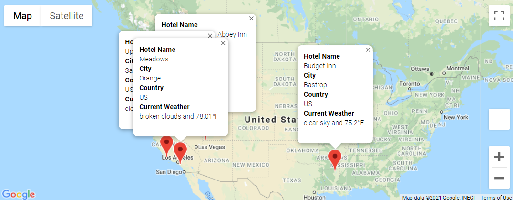

# World_Weather_Analysis

## Overview of Analysis:
The purpose of the World Weather analysis is to generate random latitudes and longitudes and using these data sets, find nearby cities into a dataframe. Then weather data is pulled from OpenWeather using API's. The information is then cleaned and organized for a temperature set that is between a user inputed criteria. The new range is the selected vacation options that are now used to search a nearby hotel to that city location. Finally, four cities in a reasonable distance are chosen and travel itineray is created. The directions are put onto a map and saved as well as their nearest hotel. This was completed by using Panda to code on Jupyter Notebook and Open Weather to collect the date and gmaps to generate the mapping. 

## Results

The largest total fares are in Urban areas due to the concentration of people and drivers. Urban areas naturally have more people living within close proximity compared to Suburban and Rural areas, where Rural areas have a lower population with further proximity of people living near each other. The graph fairly represents the 3 types by showcasing the largest total fares to Urban cities and the lease total fares to Rural cities. The graph also showcases that the least amount of rides happen in early January which is probably due to the inclimental weather. There is a significant increase in the last week of February in all 3 areas which could be realated to an event or holiday that could have created the surge. 

### Summary of Possible Vacations Locations based on User Inputed Criteria

### Summary of Travel Directions

### Summary of Hotel Information

